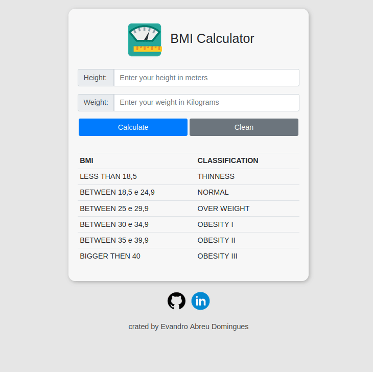

# :balance_scale: BMI Calculator

:memo: To calculate the BMI (body mass index) it is only necessary to enter the weight and height of the person who wants to know the BMI.

:point_right: [Click here](https://bmi-tool.netlify.app/) to use.

:point_down: To clone the project with SSH:

    git clone git@github.com:evandroad/bmi.git

:point_down: To clone the project with HTTP:

    git clone https://github.com/evandroad/bmi.git
